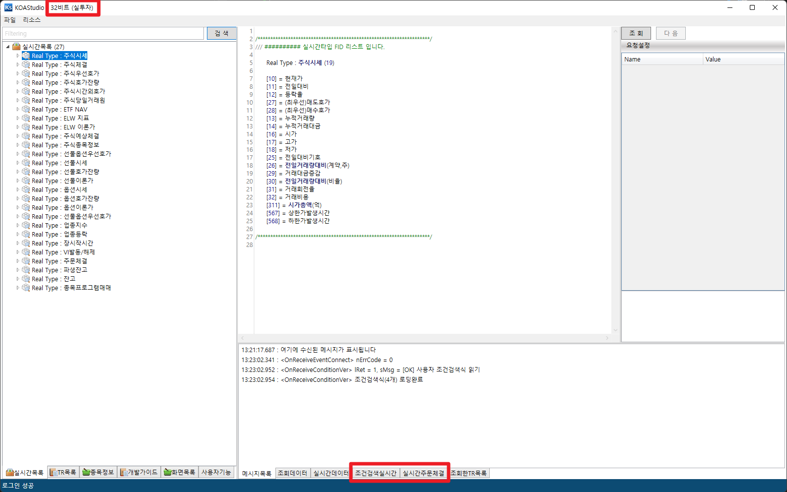
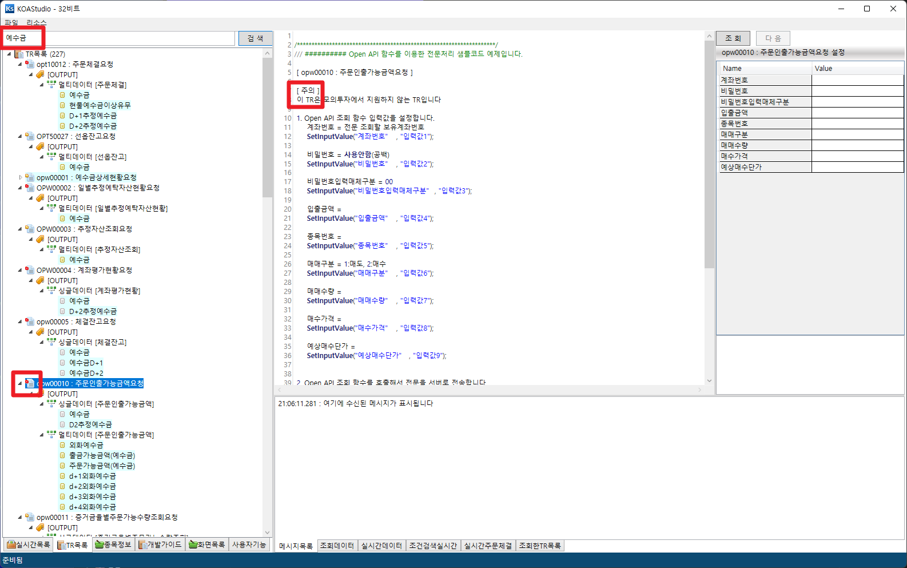
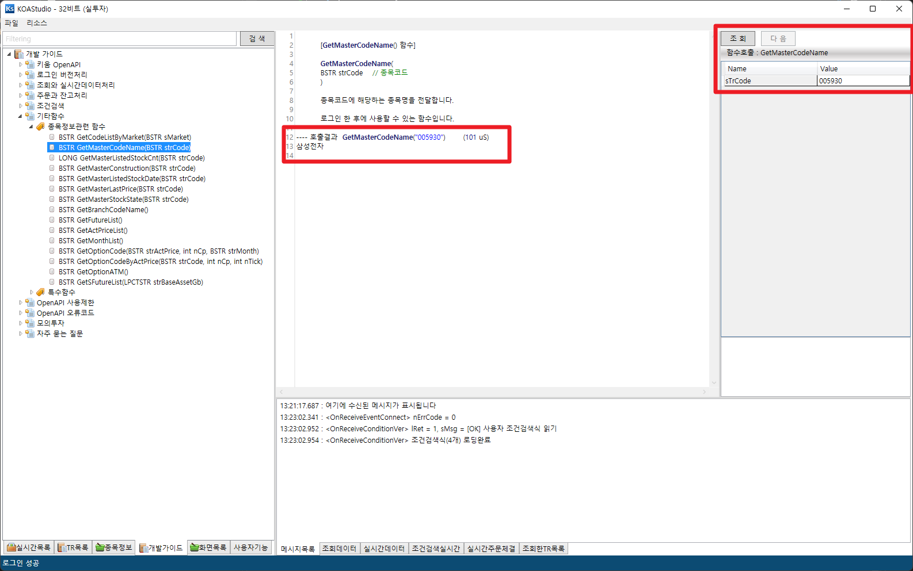
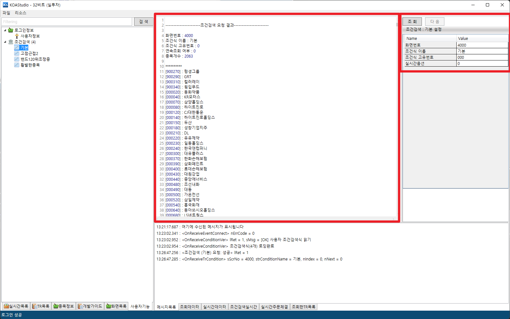
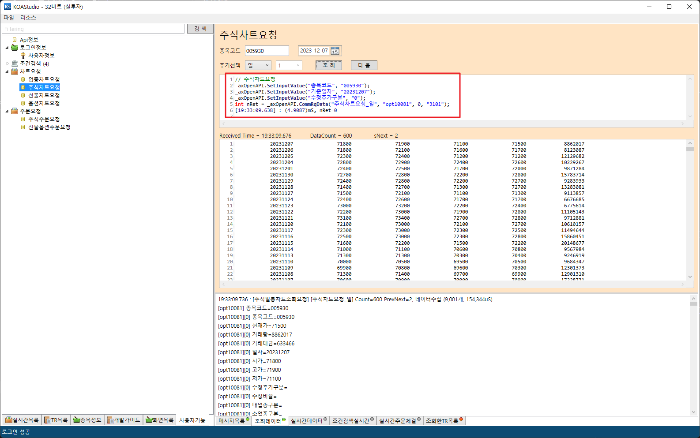

# KOAStudio

키움증권 KOAStudio clone project

## 📁 개발환경

| Name                                                                                         | Framework                                                                                                                                                                                                                                                                                                                                                                                                                                                                                                                                                                                                                                                                                                                                                                                                                                                                       |
| -------------------------------------------------------------------------------------------- | ------------------------------------------------------------------------------------------------------------------------------------------------------------------------------------------------------------------------------------------------------------------------------------------------------------------------------------------------------------------------------------------------------------------------------------------------------------------------------------------------------------------------------------------------------------------------------------------------------------------------------------------------------------------------------------------------------------------------------------------------------------------------------------------------------------------------------------------------------------------------------- |
| **Development tool, language**          |VisualStudio2022, C# |
| **UI Design**          |WPF, MVVM |
| **KOAStudio.Core** KOAStudio MVVM core Library          |   |
| **KOAStudio** Main project          |   |
| **3rd nuget packages**          |CommunityToolkit.Mvvm Microsoft.Extensions.DependencyInjection Microsoft.Xaml.Behaviors.Wpf AvalonEdit System.Text.Encoding.CodePages Costura.Fody KHOpenApi.NET |

## 📷 Screenshots
* 키움증권 KOAStudioSA 기능 + 실투자로그인, 실시간 주문체결 출력, 실시간 조건검색 이벤트 출력

* 필터링 검색, TR목록에서 [주의] 항목 빨강 레벨 표시

* OpenApi 함수 직접호출

* 조건검색식 호출

